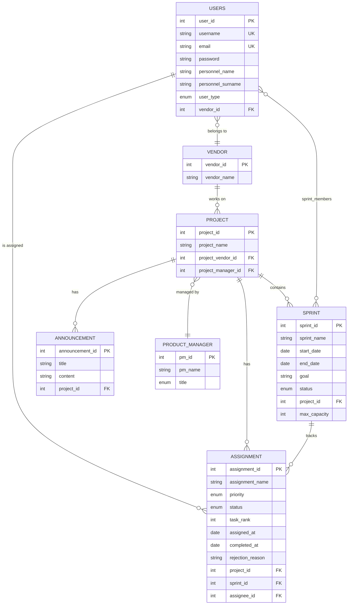

<div align="center">

# VMS — Vendor Management System

**A full-stack, role-based project management platform for coordinating vendor teams, sprint workflows, and task delivery at scale.**

[](https://openjdk.org/)
[](https://spring.io/projects/spring-boot)
[](https://vuejs.org/)
[](https://www.postgresql.org/)
[](https://docs.docker.com/compose/)
[](https://swagger.io/)

---

*Built as a graduation capstone project — engineered with production-grade architecture, clean separation of concerns, and enterprise patterns.*

</div>

---

## Table of Contents

- [Overview](#overview)
- [Key Features](#key-features)
- [Architecture](#architecture)
- [Tech Stack](#tech-stack)
- [Entity-Relationship Model](#entity-relationship-model)
- [API Endpoints](#api-endpoints)
- [Role-Based Access](#role-based-access)
- [Project Structure](#project-structure)
- [Getting Started](#getting-started)
- [Environment Variables](#environment-variables)
- [Engineering Decisions](#engineering-decisions)
- [Roadmap](#roadmap)
- [License](#license)

---

## Overview

VMS is an **enterprise-grade Vendor Management System** designed to solve a real-world coordination problem: how do organizations manage multiple external vendor teams, track sprint progress, and maintain visibility over task delivery — all within a single, unified platform?

The system provides **three distinct role-based dashboards** (Product Manager, Vendor Admin, and Personnel), each tailored to the user's responsibilities. It implements a full **Agile/Scrum workflow** with sprint planning, Kanban-style task boards, performance analytics, and a built-in announcement system.

### The Problem It Solves

In organizations that outsource development to multiple vendors, coordination becomes a bottleneck:
- **Product Managers** need a bird's-eye view across all vendors and projects
- **Vendor Admins** need to manage their team's capacity and review task quality
- **Personnel (Developers)** need a focused view of their assigned tasks

VMS bridges these gaps with role-aware dashboards, enforced capacity constraints, and real-time performance tracking.

---

## Key Features

### Authentication & Authorization
- Session-based authentication with **BCrypt** password hashing
- Role-based route protection with **Vue Router navigation guards**
- Three user roles: `MANAGER`, `VENDOR_ADMIN`, `PERSONNEL`
- "Remember Me" persistent login via `localStorage`

### Role-Specific Dashboards
- **Product Manager**: Aggregated task statistics (pie chart), vendor performance comparison, project/sprint overview
- **Vendor Admin**: Team performance metrics, employee-level analytics, sprint capacity visualization
- **Personnel**: Personal task summary with status breakdown and sprint deadline countdown

### Sprint Management
- Full CRUD with **2-week auto-calculated sprint duration**
- **One active sprint per developer** constraint — prevents overcommitment
- Sprint lifecycle: `PLANNED` → `ACTIVE` → `COMPLETED`
- Member assignment with per-developer **capacity tracking** (10 story points max)

### Task / Assignment Management
- Kanban-style task board with **drag-and-drop** status transitions
- Task states: `TODO` → `IN_PROGRESS` → `IN_REVIEW` → `COMPLETED`
- **Priority levels**: `LOW`, `MEDIUM`, `HIGH`, `OPTIONAL`
- **Difficulty ranking** (1-5 story points) with sprint capacity enforcement
- **Task review workflow**: Vendor Admins approve/reject tasks with rejection reasons

### Performance Analytics
- **Vendor-level**: Completed tasks/sprints, total vs. completed story points
- **Employee-level**: Task completion rate, average completion time (business days), point throughput
- Chart.js-powered visualizations (pie charts, progress bars)

### Announcement System
- Project-scoped announcements for team-wide communication
- Full audit trail with `createdBy` / `updatedBy` tracking

### Audit Trail & Soft Deletes
- `BaseEntity` superclass with automatic `createdAt`, `updatedAt`, `createdBy`, `updatedBy` via **Spring Data JPA Auditing**
- **Soft-delete pattern** — records are marked inactive (`isActive = 0`) rather than physically removed
- Custom `X-User` HTTP header for request-level auditing

---

## Architecture

```
+------------------------------------------------------------------+
|                        DOCKER COMPOSE                            |
|                                                                  |
|  +-------------+    +------------------+    +----------------+   |
|  |   Frontend   |    |     Backend      |    |   PostgreSQL   |   |
|  |  Vue 3 +     |--->|  Spring Boot 4   |--->|    17-alpine   |   |
|  |  Nginx       |    |  REST API        |    |                |   |
|  |  :5173/80    |    |  :8081           |    |  :5432         |   |
|  +-------------+    +------------------+    +----------------+   |
|        |                     |                                    |
|   SPA + API Proxy      Swagger UI                                |
|   (nginx reverse       /swagger-ui.html                          |
|    proxy for /api/)                                              |
+------------------------------------------------------------------+
```

### Backend Architecture (Layered)

```
Controller Layer        ->  REST endpoints, request validation, Swagger docs
    |
Service Layer           ->  Business logic, transaction management, domain rules
    |
Repository Layer        ->  Spring Data JPA, derived queries, custom JPQL
    |
Entity Layer            ->  JPA entities with inheritance (BaseEntity), enums
```

### Frontend Architecture (Component-Based)

```
Router (vue-router)     ->  Route guards, role-based redirection
    |
Views                   ->  Page-level components (PM, Vendor, Personnel)
    |
Components              ->  Reusable UI: Sidebar, TopBar, AppLayout
    |
Services                ->  Axios HTTP client, auth state management
```

---

## Tech Stack

| Layer | Technology | Purpose |
|-------|-----------|---------|
| **Language** | Java 21 | Backend application logic |
| **Framework** | Spring Boot 4.0.1 | REST API, dependency injection, auto-config |
| **ORM** | Spring Data JPA + Hibernate | Object-relational mapping, auditing |
| **Security** | Spring Security + BCrypt | Password hashing, filter chain |
| **Validation** | Jakarta Bean Validation | Request DTO validation |
| **API Docs** | SpringDoc OpenAPI 3.0.1 | Auto-generated Swagger UI |
| **Frontend** | Vue 3 + Vite 7 | Reactive SPA with Composition API |
| **Routing** | Vue Router 4 | Client-side routing with navigation guards |
| **HTTP Client** | Axios | API communication |
| **Charts** | Chart.js + vue-chartjs | Dashboard data visualization |
| **Database** | PostgreSQL 17 | Relational data persistence |
| **Containerization** | Docker + Docker Compose | Multi-container orchestration |
| **Web Server** | Nginx | Production-grade static file serving + API reverse proxy |
| **Build Tool** | Maven (backend) / npm (frontend) | Dependency management, build lifecycle |
| **Code Gen** | Lombok | Boilerplate reduction (getters, setters, constructors) |

---

## Entity-Relationship Model



> All entities inherit from `BaseEntity` which provides `created_at`, `updated_at`, `created_by`, `updated_by`, and `is_active` (soft-delete flag).

---

## API Endpoints

All endpoints are prefixed with `/api` and documented via **Swagger UI** at `/swagger-ui.html`.

### Authentication
| Method | Endpoint | Description |
|--------|----------|-------------|
| `POST` | `/api/auth/login` | Authenticate user (returns user details + role) |
| `POST` | `/api/auth/register` | Register new user account |

### Vendors
| Method | Endpoint | Description |
|--------|----------|-------------|
| `GET` | `/api/vendors` | List all vendors |
| `GET` | `/api/vendors/{id}` | Get vendor by ID |
| `POST` | `/api/vendors` | Create vendor |
| `PUT` | `/api/vendors/{id}` | Update vendor |
| `DELETE` | `/api/vendors/{id}` | Soft-delete vendor |

### Projects
| Method | Endpoint | Description |
|--------|----------|-------------|
| `GET` | `/api/projects` | List all projects (filterable by `vendorId`) |
| `GET` | `/api/projects/{id}` | Get project by ID |
| `POST` | `/api/projects` | Create project |
| `PUT` | `/api/projects/{id}` | Update project |
| `DELETE` | `/api/projects/{id}` | Soft-delete project |

### Sprints
| Method | Endpoint | Description |
|--------|----------|-------------|
| `GET` | `/api/sprints` | List sprints (filterable by `projectId`) |
| `GET` | `/api/sprints/{id}` | Get sprint by ID |
| `POST` | `/api/sprints` | Create sprint (auto-calculates end date) |
| `PUT` | `/api/sprints/{id}` | Update sprint |
| `DELETE` | `/api/sprints/{id}` | Soft-delete sprint |

### Assignments (Tasks)
| Method | Endpoint | Description |
|--------|----------|-------------|
| `GET` | `/api/assignments` | List tasks (filter by `projectId`, `sprintId`, `vendorId`, `assigneeId`) |
| `GET` | `/api/assignments/{id}` | Get task by ID |
| `POST` | `/api/assignments` | Create task (validates developer capacity) |
| `PATCH` | `/api/assignments/{id}/status` | Update task status (with review workflow) |
| `DELETE` | `/api/assignments/{id}` | Soft-delete task |

### Dashboard & Analytics
| Method | Endpoint | Description |
|--------|----------|-------------|
| `GET` | `/api/dashboard/stats` | Task distribution stats (filterable by `userId`, `vendorId`, `projectId`) |
| `GET` | `/api/dashboard/vendor-performance` | Vendor-level performance metrics |
| `GET` | `/api/dashboard/employee-performance` | Employee-level performance metrics (by `vendorId`) |

### Users & Product Managers
| Method | Endpoint | Description |
|--------|----------|-------------|
| `GET/POST/PUT/DELETE` | `/api/users/**` | Full CRUD for user management |
| `GET/POST/PUT/DELETE` | `/api/product-managers/**` | Full CRUD for product manager management |

### Announcements
| Method | Endpoint | Description |
|--------|----------|-------------|
| `GET/POST/PUT/DELETE` | `/api/announcements/**` | Project-scoped announcement management |

---

## Role-Based Access

The system implements **three tiers of access control**, each with a dedicated dashboard and navigation:

```
+-------------------------------------------------------------+
|                    PRODUCT MANAGER (PM)                       |
|  - Dashboard: Global task stats + vendor performance charts   |
|  - Manage: Projects, Sprints, Assignments, Vendors, PMs      |
|  - View: Read-only Kanban board across all projects           |
|  - Cannot: Approve/reject task reviews                        |
+-------------------------------------------------------------+
|                      VENDOR ADMIN                             |
|  - Dashboard: Team task stats + employee performance          |
|  - Manage: Sprint members, task assignments, personnel        |
|  - Review: Approve/reject tasks (IN_REVIEW -> COMPLETED)      |
|  - Scope: Limited to own vendor's projects and team           |
+-------------------------------------------------------------+
|                   PERSONNEL (Developer)                       |
|  - Dashboard: Personal task breakdown + sprint countdown      |
|  - Tasks: Drag-and-drop Kanban for own assignments            |
|  - Scope: Can only see and interact with own tasks            |
+-------------------------------------------------------------+
```

---

## Project Structure

```
VMS-Final/
├── docker-compose.yml                    # Multi-container orchestration
├── .env.example                          # Environment variable template
│
├── VMS/                                  # -- Spring Boot Backend --
│   ├── Dockerfile                        # Multi-stage build (JDK -> JRE)
│   ├── pom.xml                           # Maven dependencies
│   └── src/main/java/com/example/demo/
│       ├── VmsApplication.java           # Application entry point
│       ├── GlobalExceptionHandler.java   # Centralized error handling
│       ├── config/
│       │   ├── SecurityConfig.java       # Spring Security filter chain
│       │   ├── CorsConfig.java           # CORS policy for frontend origins
│       │   ├── DataLoader.java           # Seed data for development
│       │   ├── UserFilter.java           # X-User header extraction
│       │   ├── CurrentUser.java          # ThreadLocal user context
│       │   └── AuditorAwareImpl.java     # JPA auditing integration
│       ├── controllers/                  # REST controllers (9 endpoints)
│       ├── services/
│       │   ├── abstracts/                # Service interfaces
│       │   └── concretes/                # Service implementations
│       ├── repositories/                 # Spring Data JPA repositories
│       ├── entities/
│       │   ├── abstracts/BaseEntity.java # Audit fields + soft-delete
│       │   └── concretes/               # Domain entities (7 models)
│       ├── dto/
│       │   ├── request/                  # 16 request DTOs
│       │   └── response/                # 10 response DTOs
│       └── enums/                        # 5 domain enums
│
└── VMS-Frontend.PleaseWork/Ye/VMS-Frontend.Vue/VMS-Frontend/
    ├── Dockerfile                        # Multi-stage build (Node -> Nginx)
    ├── nginx.conf                        # SPA fallback + API reverse proxy
    ├── package.json                      # Vue 3 + Vite + Chart.js
    └── src/
        ├── main.js                       # App bootstrap
        ├── App.vue                       # Root component
        ├── style.css                     # Global styles (dark theme)
        ├── router/index.js              # Route definitions + auth guards
        ├── services/authService.js       # Auth state management
        ├── components/
        │   ├── AppLayout.vue             # Shell layout (sidebar + content)
        │   ├── Sidebar.vue               # Role-aware navigation
        │   └── TopBar.vue                # Header with user info
        └── views/
            ├── Login.vue                 # Authentication page
            ├── PMhome.vue                # PM dashboard
            ├── VendorAdminHome.vue        # Vendor admin dashboard
            ├── PersonnelHome.vue          # Developer dashboard
            ├── PersonnelTasks.vue         # Developer Kanban board
            ├── Announcements.vue          # Shared announcement view
            ├── pm/                        # PM-specific views
            │   ├── Projects.vue
            │   ├── ProjectDetail.vue
            │   ├── Sprints.vue
            │   ├── Assignments.vue
            │   └── Vendors.vue
            └── vendor/                    # Vendor admin views
                ├── VendorProjects.vue
                ├── VendorSprints.vue
                ├── VendorAssignments.vue
                ├── VendorPersonnel.vue
                ├── VendorPerformance.vue
                └── VendorReviews.vue
```

---

## Getting Started

### Prerequisites

- **Docker** & **Docker Compose** (recommended — runs everything)
- Java 21 + Maven (for local backend development)
- Node.js 18+ (for local frontend development)

### Option 1: Docker Compose (Recommended)

Spin up the entire stack with a single command:

```bash
git clone https://github.com/aykutern/VMS-Final.git
cd VMS-Final
cp .env.example .env    # then edit .env with your credentials
docker-compose up --build
```

Once running:
| Service | URL |
|---------|-----|
| Frontend | [http://localhost:5173](http://localhost:5173) |
| Backend API | [http://localhost:8081](http://localhost:8081) |
| Swagger UI | [http://localhost:8081/swagger-ui.html](http://localhost:8081/swagger-ui.html) |
| PostgreSQL | `localhost:5432` |

### Option 2: Local Development

**Backend:**
```bash
cd VMS
./mvnw spring-boot:run
```
> Requires a running PostgreSQL instance on `localhost:5432` with database `graduationDB`.

**Frontend:**
```bash
cd VMS-Frontend.PleaseWork/Ye/VMS-Frontend.Vue/VMS-Frontend
npm install
npm run dev
```
> Dev server starts at `http://localhost:5173` with hot-reload enabled.

### Demo Credentials

The application ships with a `DataLoader` that seeds sample data on first run. Check the seeded users in `DataLoader.java` or register a new account.

---

## Environment Variables

The backend is configured via environment variables. Copy `.env.example` to `.env` and fill in your values:

| Variable | Description |
|----------|-------------|
| `POSTGRES_DB` | PostgreSQL database name |
| `POSTGRES_USER` | PostgreSQL user |
| `POSTGRES_PASSWORD` | PostgreSQL password |
| `DB_HOST` | Database host (use `db` for Docker, `localhost` for local) |
| `DB_PORT` | Database port (default: `5432`) |
| `DB_NAME` | Database name used by Spring Boot |
| `DB_USERNAME` | Database user used by Spring Boot |
| `DB_PASSWORD` | Database password used by Spring Boot |

---

## Engineering Decisions

### Why Soft Deletes?
All entities use a `BaseEntity` with an `isActive` flag instead of physical `DELETE` statements. This preserves referential integrity, enables audit trails, and allows data recovery — a pattern commonly used in enterprise systems.

### Why Per-Developer Sprint Capacity?
Rather than capping a sprint's total points, VMS enforces a **10-point cap per developer per sprint**. This is more realistic — it ensures no single team member is overloaded, even if the sprint could technically absorb more work.

### Why X-User Header Auditing?
The system uses a custom `X-User` HTTP header (extracted via `UserFilter`) combined with Spring Data JPA's `@CreatedBy`/`@LastModifiedBy` annotations. This provides lightweight auditing without the overhead of full JWT/session-based auth on every write operation.

### Why Nginx Reverse Proxy?
In production (Docker), the Vue SPA is served by Nginx, which also **reverse-proxies** `/api/` calls to the backend container. This eliminates CORS issues in production and mirrors how real-world SPAs are deployed.

### Why 2-Week Auto-Calculated Sprints?
Sprint durations are automatically set to 14 days (start date + 13 days) to enforce consistent Scrum cadence. This reduces configuration errors and keeps teams aligned on delivery timelines.

### Task Review Workflow
Tasks follow a review pipeline: developers move tasks to `IN_REVIEW`, and only **Vendor Admins** (not Product Managers) can approve or reject them. This enforces separation of concerns — PMs oversee, vendor leads review quality.

---

## Roadmap

- [ ] JWT token-based authentication
- [ ] WebSocket notifications for real-time task updates
- [ ] File attachment support for assignments
- [ ] Sprint retrospective and burndown charts
- [ ] Email notifications for task status changes
- [ ] Unit and integration test suite
- [ ] CI/CD pipeline (GitHub Actions)
- [ ] Kubernetes deployment manifests

---

## License

This project was built as a **graduation capstone project**. Feel free to explore, fork, and build upon it.
